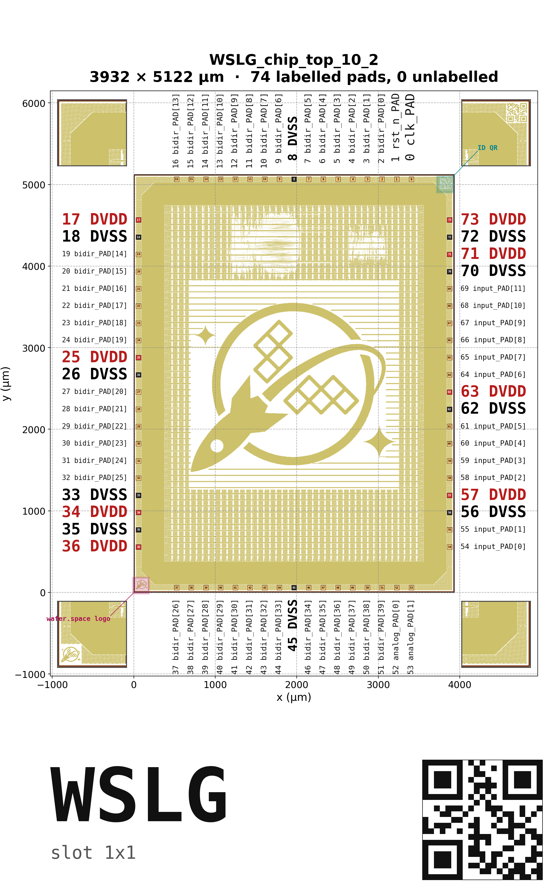

# reticle_diagrams

Generates annotated pad-pinout diagrams for every chip on the
wafer.space `ws-run1` reticle.

For each top-level design in `ws-run1/layout/reticle.oas`, the
generator emits a PNG, SVG, and PDF showing:

- the GDS-rendered chip body as a background, in the wafer.space
  two-tone style (yellow `Metal5` + dark-red `Pad` layer);
- every peripheral I/O pad drawn as a colored rectangle, classified
  by net (ground / digital power / analog power / signal);
- the net name for each pad, looked up from `Metal5_Label` and
  `MetalTop_Label` text whose position falls inside the pad;
- corner zoom insets highlighting the `gf180mcu_ws_ip__id` /
  `gf180mcu_ws_ip__logo` template cells and alignment marks;
- an info panel with slot dimensions, the chip name, and a
  project-specific QR code that reproduces the per-chip QR stamped
  on each design by the wafer.space precheck pipeline.



## Repository layout

This repository expects to be checked out **alongside** the
`ws-run1` repo, because the generator reads the reticle layout and
the GF180MCU layer-properties file directly from there:

```
parent-dir/
├── ws-run1/
│   ├── layout/reticle.oas
│   └── lyp/gf180mcu.lyp
└── reticle_diagrams/    ← this repo
```

The exact paths are pinned in `make_diagrams.py` (`REPO`, `OAS`,
`LYP` near the top of the file).

## Install

The project uses [`uv`](https://docs.astral.sh/uv/) for dependency
management. From the repo root:

```bash
uv sync
```

Runtime dependencies (see `pyproject.toml`):

- `klayout` — reads OASIS/GDS and renders the chip background
- `gdstk` — geometry helpers
- `matplotlib` — produces the final PNG / SVG / PDF
- `segno` — generates the per-chip QR code in the info panel

## Usage

Render every chip on the reticle:

```bash
uv run make_diagrams.py
```

Output is written to `diagrams/`, with one `.png` / `.svg` / `.pdf`
trio per design plus an `index.md` summarizing pad counts. The
generator also prints a warning whenever the slot size computed
from the GDS disagrees with the entry in `PROJECT_SIZES_README`,
which guards against the layout and the README drifting apart.

For a faster sanity check during development, the smoketest renders
a curated subset (WSLG, TRID, TQVA, ISHI-KAI, KIAN, MOS2) covering
the corner cases — long pad names, the smallest 0.5×0.5 die, busy
interiors, full 1×1 SoCs:

```bash
uv run make_diagrams_smoketest.py
```

## Repository contents

- `make_diagrams.py` — full generator; renders every top-level
  design in the reticle.
- `make_diagrams_smoketest.py` — fast subset run that imports from
  `make_diagrams.py`; used for iterating on layout/style changes.
- `explore.py` — prints the top-level cell hierarchy of
  `reticle.oas`; handy when adding a new chip.
- `probe_*.py` — exploration scripts used while reverse-engineering
  the precheck QR encoding, the `gf180mcu.lyp` dither stripes, the
  template corner cells, and other layout quirks. They are kept in
  the repo for future layout-debugging work and are not part of the
  regular generation workflow.
- `diagrams/` — committed PNG / SVG / PDF output of the most
  recent run, plus `index.md`.

## License

Licensed under the Apache License, Version 2.0. See [LICENSE](LICENSE).
